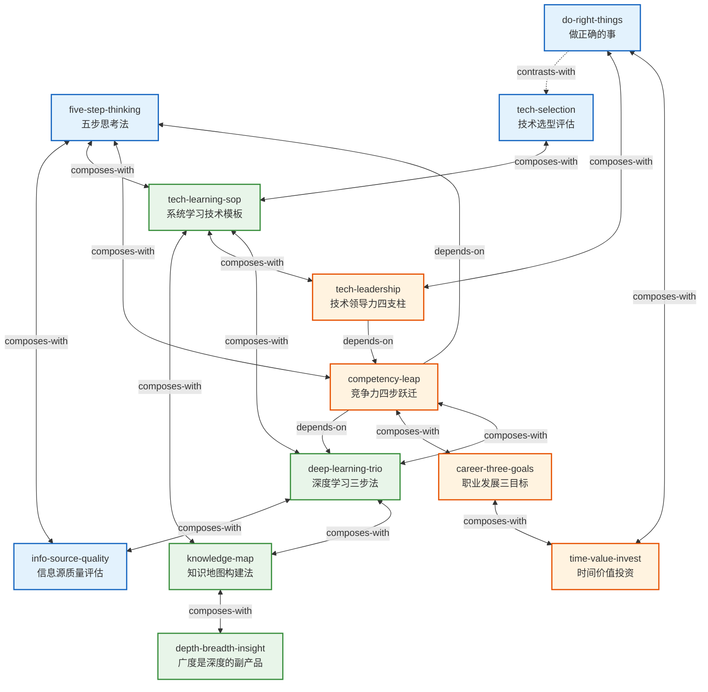

# 《左耳听风：传奇程序员练级攻略》Skill 索引

> 作者：陈皓（左耳朵耗子）
> 来源书籍：《左耳听风：传奇程序员练级攻略》
> Skill 总数：12
> 关系总数：17

---

## 按主题分组

### 一、学习方法与知识管理（4个）

| # | slug | 名称 | 一句话描述 |
|---|------|------|-----------|
| 1 | `deep-learning-trio` | 深度学习三步法 | 将知识从输入推进到内化的三个环节：采集-缝合-转换 |
| 2 | `tech-learning-sop` | 系统学习技术模板 | 学习任何技术的六维度检查清单：背景/优劣/场景/核心/原理/对比 |
| 3 | `knowledge-map` | 知识地图构建法 | 用联想记忆法将知识组织成动态生长的树状/图状结构 |
| 4 | `depth-breadth-insight` | 广度是深度的副产品 | 深度优先的学习策略——深度自然带来广度 |

### 二、思考与决策（4个）

| # | slug | 名称 | 一句话描述 |
|---|------|------|-----------|
| 5 | `five-step-thinking` | 五步思考法 | 五步递进的独立思考框架，用于评判信息可信度和深度分析 |
| 6 | `info-source-quality` | 信息源质量评估方法 | 用四维度（一手性/可验证性/时间检验/信息密度）评估信息来源质量 |
| 7 | `do-right-things` | 做正确的事的决策框架 | 用五条标准判断一件事值不值得做，强调长期主义和执行勇气 |
| 8 | `tech-selection` | 技术选型四条件评估法 | 用四个条件+大数据验证评估技术产品的市场成熟度 |

### 三、职业发展与领导力（4个）

| # | slug | 名称 | 一句话描述 |
|---|------|------|-----------|
| 9 | `competency-leap` | 竞争力四步跃迁模型 | 竞争力发展的四阶段路径：认知→知识→技能→领导力 |
| 10 | `career-three-goals` | 程序员职业发展三目标模型 | 职场→经历→自由（工作自由→技能自由→物质自由）三层递进 |
| 11 | `time-value-invest` | 时间价值投资框架 | 将时间视为投资本金，投向有复利的四个方向 |
| 12 | `tech-leadership` | 技术领导力四支柱模型 | 吃透基础技术/提高学习能力/坚持做正确的事/高标准要求自己 |

---

## Skill 引用关系图

### 关系图例

- **实线箭头** (`depends-on`): A的使用前提是先理解B
- **粗线双向** (`composes-with`): A和B经常配合使用
- **虚线双向** (`contrasts-with`): A和B是两种可选方案，看情境选一

---

## 推荐学习顺序

基于 depends-on 关系和从基础到进阶的逻辑，推荐以下学习路径：

### 第一阶段：基础工具（先学）

1. **`five-step-thinking`** — 五步思考法是多个 skill 的底层思维工具
2. **`info-source-quality`** — 学会筛选信息源是所有学习活动的前提
3. **`knowledge-map`** — 掌握知识组织方法，为后续学习建立"骨架"

### 第二阶段：学习方法（再学）

4. **`deep-learning-trio`** — 掌握"采集-缝合-转换"的完整学习流程
5. **`tech-learning-sop`** — 学习具体技术时的六维度检查清单（与 deep-learning-trio 配合使用）
6. **`depth-breadth-insight`** — 明确"深度优先"的学习策略

### 第三阶段：决策框架（接着学）

7. **`do-right-things`** — 掌握"做不做"的价值判断框架
8. **`tech-selection`** — 掌握技术选型的具体评估方法（与 do-right-things 对比学习）
9. **`time-value-invest`** — 掌握时间投资的复利思维

### 第四阶段：职业与领导力（最后学）

10. **`competency-leap`** — 理解竞争力发展的四阶段路径（需要前面阶段的工具积累）
11. **`career-three-goals`** — 明确职业发展的三层目标（与 competency-leap 配合使用）
12. **`tech-leadership`** — 四支柱模型是整个体系的集大成（依赖前面所有阶段的积累）

---

## 关系统计

| 关系类型 | 数量 | 具体列表 |
|---------|------|---------|
| depends-on | 3 | competency-leap→five-step-thinking, competency-leap→deep-learning-trio, tech-leadership→competency-leap |
| contrasts-with | 1 | do-right-things↔tech-selection |
| composes-with | 13 | 见下方详细列表 |

### composes-with 完整列表

| # | Skill A | Skill B | 配合理由 |
|---|---------|---------|---------|
| 1 | five-step-thinking | info-source-quality | 事前筛选+事后分析的完整信息质量链 |
| 2 | five-step-thinking | tech-learning-sop | 六维度SOP的"对比"步使用五步思考法的因果检验 |
| 3 | five-step-thinking | competency-leap | 五步思考法是竞争力跃迁"认知"阶段的核心工具 |
| 4 | deep-learning-trio | info-source-quality | 信息源评估是"采集"环节的具体工具 |
| 5 | deep-learning-trio | tech-learning-sop | "怎么学"+"学什么"的典型组合 |
| 6 | deep-learning-trio | knowledge-map | 知识地图是"缝合"环节的核心方法 |
| 7 | deep-learning-trio | competency-leap | 三步法是竞争力跃迁"知识"和"技能"阶段的操作方法 |
| 8 | tech-learning-sop | knowledge-map | 六维度SOP是知识地图在技术学习场景的预制模板 |
| 9 | tech-learning-sop | tech-leadership | 六维度SOP是技术领导力"学习能力"支柱的具体方法 |
| 10 | knowledge-map | depth-breadth-insight | 策略选方向+工具建地图 |
| 11 | do-right-things | tech-leadership | "做正确的事"是技术领导力支柱三的核心工具 |
| 12 | do-right-things | time-value-invest | "做不做"+"时间怎么投"的完整决策链 |
| 13 | career-three-goals | time-value-invest | 宏观目标+微观执行的完整职业规划 |
| 14 | career-three-goals | competency-leap | 目标"往哪去"+路径"怎么去"的完整规划 |
| 15 | tech-selection | tech-learning-sop | 先选型判断值不值得投入，再系统学习 |
